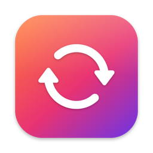
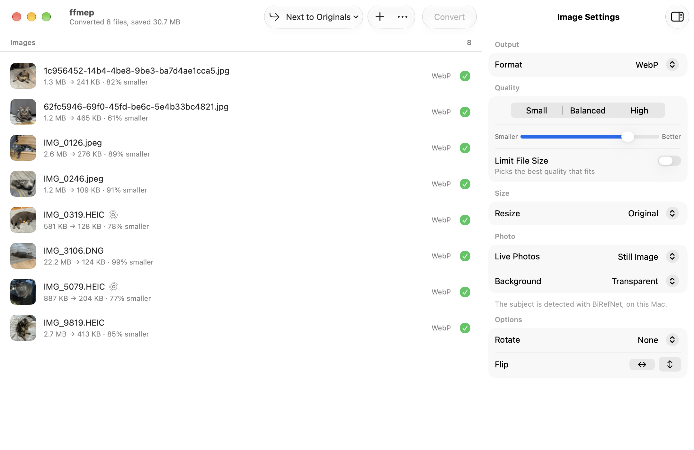
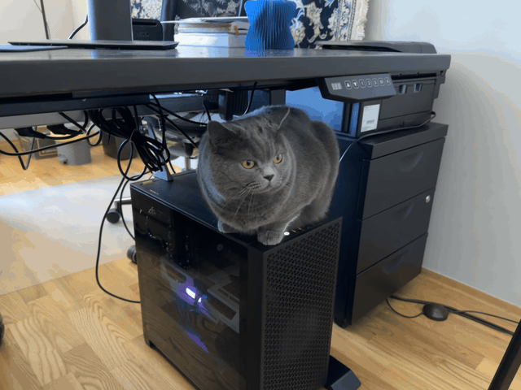
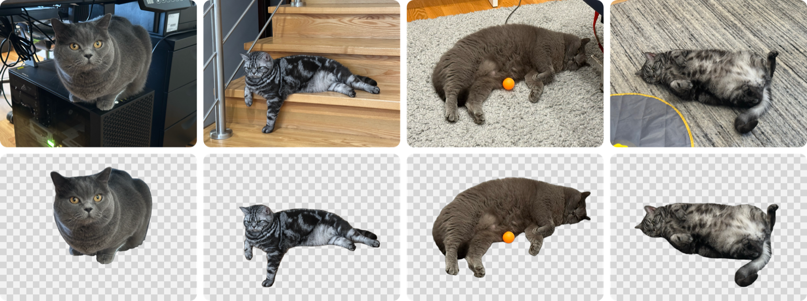

<div align="center">


<h1>ffmep</h1>

<p>
  <strong>ffmpeg, as a Mac app that feels like it shipped with the Mac.<br>
  Drop files in, pick a format, convert. Plus HEIC and WebP,<br>
  Live Photos, and background removal that runs on your machine.</strong>
</p>

<p>
  
  
  
  
</p>

<picture>
  <source media="(prefers-color-scheme: dark)" srcset="docs/window-dark.png">
  
</picture>

</div>

<p align="center">
  <sub>Eight photos in, eight transparent WebPs out, 30.7 MB lighter. JPEG, HEIC and a RAW DNG<br>
  all in one batch, cut out with BiRefNet on this Mac.</sub>
</p>

ffmpeg can do nearly anything, as long as you remember the flags. ffmep is the
flags, remembered. It uses stock macOS controls and Liquid Glass on macOS 26, so
it looks like something Apple could have shipped.

It also does a few things ffmpeg alone makes awkward: photos from an iPhone,
WebP in both directions, Live Photos, and cutting the subject out of a picture.

---

## Install

From a clone of this repo:

```bash
scripts/build-ffmpeg.sh
```

```bash
VERSION=1.0.0 scripts/make-app.sh
```

The first script builds a static arm64 ffmpeg and ffprobe into `vendor/`. It takes
a while the first time, and re-runs skip whatever already finished. It needs the
Xcode command line tools and `brew install cmake meson ninja pkgconf`.

The second builds the app, bundles that ffmpeg, signs it ad-hoc and writes
`build/ffmep.app` and `build/ffmep.zip`. Use `CONFIG=debug` for a debug build in
`build/debug/`.

Needs an Apple silicon Mac running macOS 14 or later. Build with the macOS 26 SDK
or newer to get Liquid Glass.

> [!TIP]
> The build is signed ad-hoc, so Gatekeeper will refuse the first launch. Right-click
> `ffmep.app` and choose **Open** once, and it will start normally after that.

---

## What it does

- **Video** to MP4, MOV, MKV, WebM or GIF, as H.264, HEVC, ProRes, VP9 or AV1.
  H.264, HEVC and ProRes go through VideoToolbox when the Mac has a hardware
  encoder for them, so they finish in a fraction of the time.
- **Audio** to MP3, AAC, WAV, FLAC, ALAC or Opus, including pulling the soundtrack
  out of a video.
- **Images** to WebP, JPEG, PNG or HEIC. Anything ImageIO can open goes in,
  RAW DNGs included. JPEG, PNG and HEIC are written by ImageIO directly, WebP by
  the bundled ffmpeg.
- **A file size instead of a quality.** Turn on **Limit File Size**, type 10 MB,
  and ffmep works out the bitrate that fits. Or skip it and use the slider, with
  Small, Balanced and High to start from.
- **Resize, rotate, flip, change the frame rate, strip metadata**, or squeeze out
  every last byte with maximum compression.
- **A queue that keeps moving.** Images, audio, hardware video and software video
  each get their own lane with their own limit, so a slow AV1 encode doesn't hold
  up a folder of photos.
- **Save next to the originals**, into a folder, or replace the originals. Replaced
  files go to the Trash, and only once the new file is safely written.

### Live Photos

Drop in a Live Photo, the `.HEIC` and the `.mov` together, and it shows up as one
row with a Live Photo badge. Export the still, the motion as an MP4, or the motion
as an animated GIF.

<div align="center">
  
</div>

<p align="center">
  <sub>A Live Photo, exported as a GIF at 480p. No trimming, no Photos app, no third-party site.</sub>
</p>

### Background removal

Set **Background** to **Transparent** or **White** and ffmep cuts the subject out
before converting. Formats without transparency, like JPEG, get white instead.

It works straight away with Apple's Vision framework. The first time you use it,
ffmep offers to download [BiRefNet](https://github.com/TheFilipcom4607/birefnet-coreml),
a 408 MB Core ML model with much cleaner edges on fur, hair and anything thin.
Either way it runs on your Mac, and the model can be removed again from Settings.

<div align="center">
  
</div>

<p align="center">
  <sub>Top: the originals. Bottom: what BiRefNet kept. The railing, the cables and the rug all go,<br>
  the whiskers and the ball stay.</sub>
</p>

### The bundled ffmpeg

ffmpeg 9.0.1, static, arm64, linking nothing but system libraries. Built with
x264, x265, SVT-AV1, libvpx, Opus, LAME, libwebp and dav1d, plus VideoToolbox and
AudioToolbox. Exact versions are in [`vendor/BUILDINFO.txt`](vendor/BUILDINFO.txt).

Prefer your own? Settings can switch to Homebrew's ffmpeg or any path you like.

---

## Development

```bash
swift test
```

The integration tests run real conversions and are skipped unless you point them
at a folder of sample files:

```bash
FFMEP_FIXTURES=/path/to/fixtures swift test --filter IntegrationTests
```

They use the ffmpeg in `vendor/` by default, or Homebrew's with `FFMEP_FFMPEG=homebrew`.

`make-app.sh` also fixes one thing SwiftPM gets wrong for this app. SwiftPM records
the deployment target as the SDK version in the binary, and macOS 26 then runs the
app in legacy appearance mode, without Liquid Glass. The script writes the real SDK
version back in with `vtool`.

The BiRefNet conversion scripts live in [`scripts/birefnet`](scripts/birefnet), with
usage notes at the top of `convert.py`.

---

## License

GPLv3, see [LICENSE](LICENSE). The bundled ffmpeg is built with `--enable-gpl` and
`--enable-version3`, so it is GPLv3 too. Its license files are in
[`vendor/licenses`](vendor/licenses).
